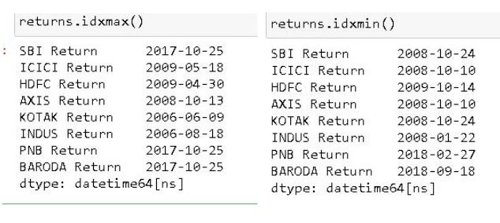

## INDIAN BANK STOCK ANALYSIS FROM 2006 TO 2020
### Overview
- Collected stock data of big Indian banks from Yahoo Finance
- Plotted Returns ,Closing and Selling prices of various banks
- Created interactive plots using cufflinks
- Visualised various socio-politcal events related stock market changes

### Code and Resources Used
- Python Version: 3.7
- Packages: pandas, numpy,matplotlib, seaborn, cufflinks, datareader,plotly
- 
- 

### Data Collection
Used python's datareader package to read stock data directly from Yahoo Finance's Website. All stocks data is from National Stock Exchange(NSE). 
The following bank data were collected.
 + AXIS Bank
 + Bank Of Baroda
 + HDFC  Bank Limited 
 + ICICI BANK
 + IndusInd Bank
 + Kotak Mahindra Bank
 +  Punjab National Bank
 + STATE BANK OF INDIA
 
With each stock I pulled the following details:
+ High
+ Low
+ Open
+ Close
+ Volume
+ Adj Close

Then I combined all the pulled data into a single dataframe and named it bank_stocks. 

  
 
 

### Exploratory Data Analysis
I created another dataframe named returns which used the returns formula to calucate and store the returns of all the bank stocks.
 

  
 
   
 
 Where Pt = Price of Stock at time 't' 
 

  
 
       

I looked at the distributions of the data and the value counts for the various categorical variables. Below are a few highlights from my EDA.

- The Min And Max stock returns: 

- Intrestlingly AXIS bank's best and worst returns in over a decade were between 2008-10-10 & 2008-10-13
   
- I also plotted the distribution of the returns of SBI & HDFC banks. Both banks have similar devations from average and considered the most stable banks in India.
   
  
- Also plotted the Simple Moving Average plot for Punjab National Banks in 2018 . A huge drop is noted relating to the controversial 2018 PNB scam.
   
  
 - A Correlation heatmap is plotted to show all the diffrent relationships between stock close prices
   
  
  ### Conclusion
  - SBI & HDFC banks have stayed the most reliable banks of the said time period
  - SBI is the best majority Govt. share bank & HDFC is the best private share bank
  
 #### Check out the attached ipynb file for more detailed analysis.
 
 ### How to Use
  - Refer to the ipynb file.
  
  ### Credits 
  -  
  -  
  -  
  
